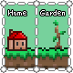

# Zone Titles

## Description

An addon for [Biome Titles](https://github.com/MGTro/BTitles-1.4.3/tree/master) mod. Allows you to create zones where you can show your custom titles!
 Let's say, you have a castle and you want a title with it's name appear when you enter this castle. With this mode you can!

First, create Zone Designator. No resources needed, only a workbench.

It will allow you to create and edit zones.

| Control        | Action                   |
|----------------|--------------------------|
| `LMB`          | Edit zone under cursor   |
| `LMB` + `LAlt` | Remove zone under cursor |
| `RMB`          | Drag to create new zone  |

## Pages
[Known Bugs](KnownBugs.md)

## Contacts

